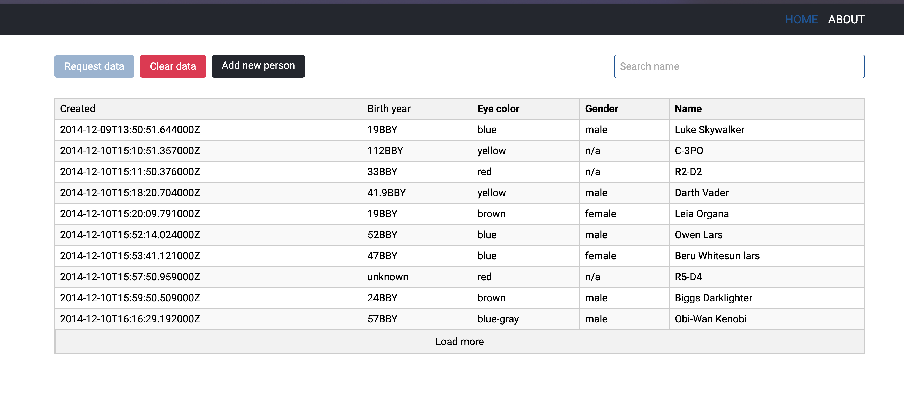

# React data table [Ссылка](https://react-table-sort.netlify.app/)

## Запусе проекта
Для запуска проекта необходимо установить зависимости командой `npm install` или `yarn install`, после установки можно запустить сервер для разработки командой `npm run dev` или `yarn dev`

## Используемые технологии
- React - библиотека для разработки пользовательских интерфейсов.
- ky - библиотека для формирования запросов к серверу (аналог axios)
- react-router-dom - набор компонентов для навигации в React-приложениях.
- mobX - библиотека для управления состоянием приложения.
- Vite - быстрый инструмент сборки для современных веб-приложений.
- typeScript - язык программирования с поддержкой статических типов.
- ESlint - инструмент статического анализа кода JavaScript/TypeScript.
- Sass - препроцессор CSS для удобства написания стилей.
- Настроен alias абсолютного пути до папки ./src для удобного импорта

## Возможности
- Данные с сервера загружаются в таблицу по запросу
- Во время первоначальной загрузки данных отображается анимированный лоадер
- Таблица сортируется по полям [name, eye_color, gender]
- При сортировке отображается стрелочка (в каком порядке сортируется и какой столбец)
- Строки в таблице можно удалять по клику
- При запросе удалить строку появляется модальное окно с анимацией
- Модалку можно закрыть на полупрозрачный фон, на клавишу Escape, на крестик и конечно же на кнопки
- Модальное окно поддерживает навигацию с помощью клавиши Tab и сохраняет фокус
- В подвале таблицы есть кнопка, по нажатию на которую можно запросить ещё порцию данных
- При выполнении запроса кнопка блокируется 
- Все данные сохраняются в localStorage и если там там есть подгружаются оттуда
- Есть кнопка для очистки всех данных
- Кнопка не работает, если нечего очищать
- Кнопка запросить данные не работает, если данные какие-то в таблице уже есть, в таком случае будет работать только "Load more" в подвале 
- При переходе на страницу добавления новой записи первое поле будет в фокусе
- Форма валидируется на пустые поля и если хоть одно пустое кнопка добавления будет заблокирована 
- При добавлении записи катапультирует на главную страницу, открывается модалка с уведомлением о создании 
- На главной так же присутствует поиск по таблице по полю name
- На странице ABOUT информация о поставленных задачах

Благодарю за внимание

[Мой телеграм](https://t.me/k0lchanov)